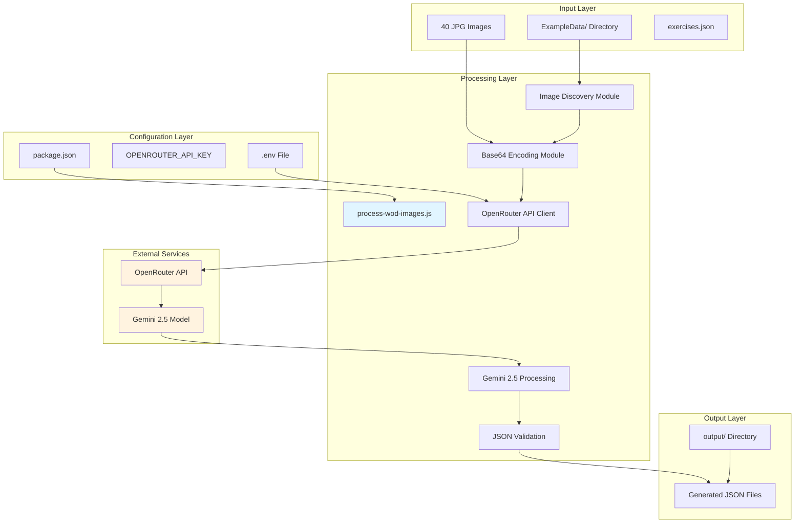
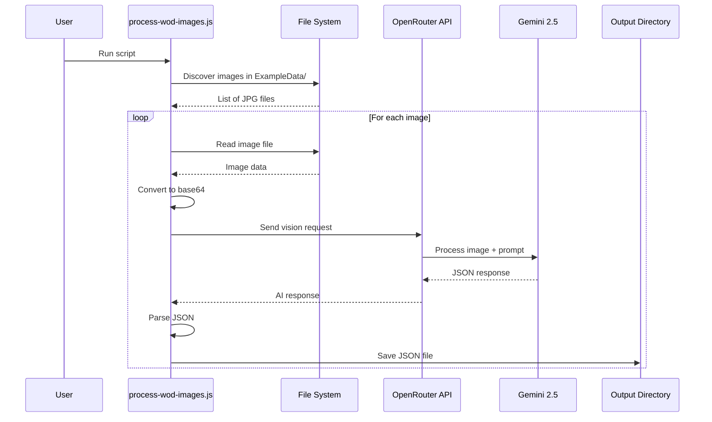
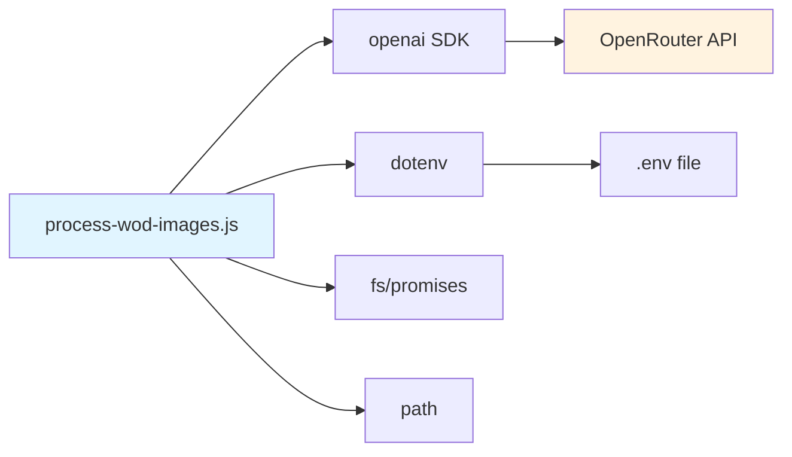
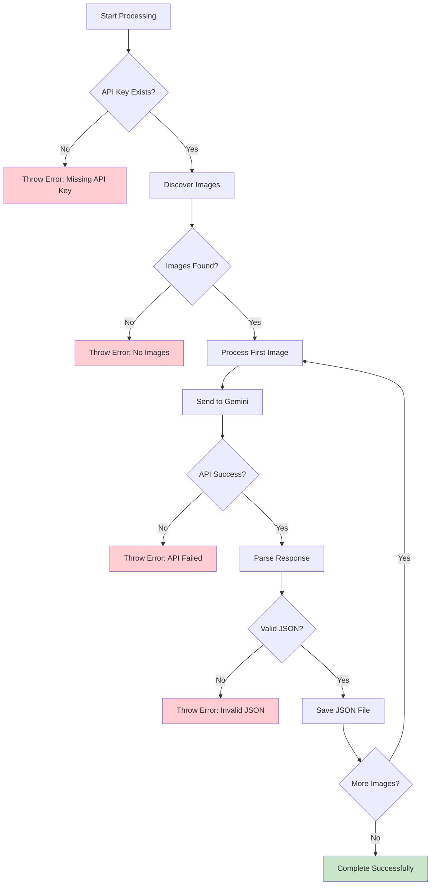
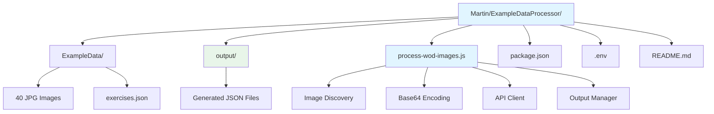
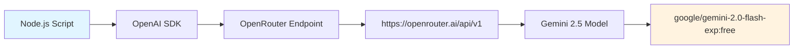

# WOD Image Processor - Architecture Diagram

## System Architecture Overview



## Data Flow Diagram



## Module Dependencies



## Error Handling Flow



## File Structure Mapping



## API Integration Details



## Processing Pipeline

```mermaid
flowchart LR
    A[Image File] --> B[Read File]
    B --> C[Convert to Base64]
    C --> D[Create API Request]
    D --> E[Send to Gemini 2.5]
    E --> F[Receive JSON Response]
    F --> G[Validate JSON]
    G --> H[Save to Output Directory]
    
    style A fill:#e8f5e9
    style H fill:#e8f5e9