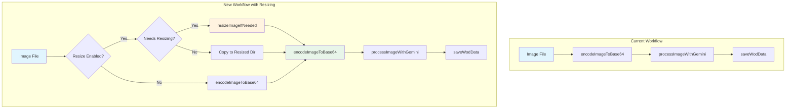
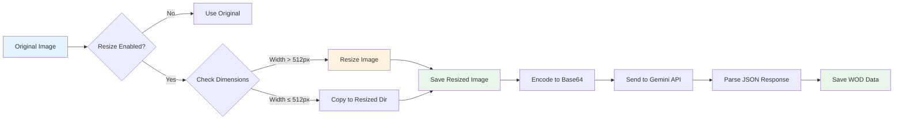
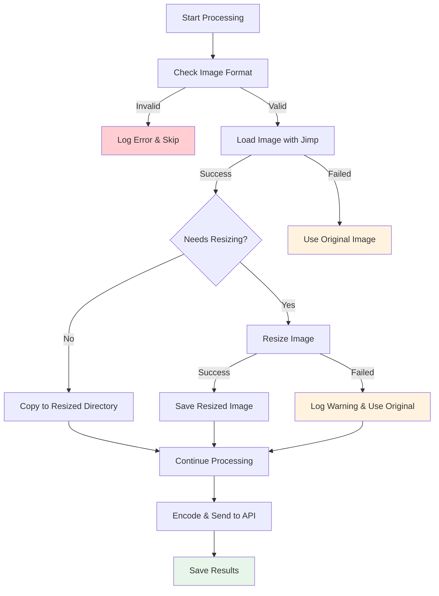

# Image Resizing Implementation Plan

## Overview

This document provides a step-by-step implementation plan for adding image resizing functionality to the WOD Image Processor. The plan includes detailed workflows, code structure, and testing strategies.

## Implementation Phases

### Phase 1: Setup and Dependencies

#### 1.1 Add Jimp Dependency
```bash
npm install jimp
```

**package.json changes:**
```json
{
  "dependencies": {
    "openai": "^4.28.0",
    "dotenv": "^16.4.5",
    "jimp": "^0.22.10"
  }
}
```

#### 1.2 Create Configuration Module
```javascript
// config/image-config.js
const path = require('path');

const IMAGE_CONFIG = {
    // Resizing settings
    resize: {
        maxWidth: 512,
        quality: 85,
        format: 'jpeg',
        suffix: '_resized_512'
    },
    
    // Directory paths
    paths: {
        inputDir: path.join(__dirname, 'ExampleData'),
        outputDir: path.join(__dirname, 'output'),
        resizedDir: path.join(__dirname, 'output', 'resized')
    },
    
    // Supported formats
    formats: ['.jpg', '.jpeg', '.png', '.gif']
};

module.exports = { IMAGE_CONFIG };
```

### Phase 2: Core Image Processing Module

#### 2.1 Create Image Processing Utilities
```javascript
// utils/image-processor.js
const Jimp = require('jimp');
const fs = require('fs').promises;
const path = require('path');
const { IMAGE_CONFIG } = require('../config/image-config');

class ImageProcessor {
    /**
     * Check if image needs resizing
     * @param {string} imagePath 
     * @returns {Promise<boolean>}
     */
    async needsResizing(imagePath) {
        try {
            const image = await Jimp.read(imagePath);
            return image.bitmap.width > IMAGE_CONFIG.resize.maxWidth;
        } catch (error) {
            console.error(`Failed to read image ${imagePath}:`, error.message);
            return false;
        }
    }

    /**
     * Resize image to max width while preserving aspect ratio
     * @param {string} imagePath 
     * @param {string} outputPath 
     * @returns {Promise<void>}
     */
    async resizeImage(imagePath, outputPath) {
        try {
            const image = await Jimp.read(imagePath);
            
            // Check if resizing is needed
            if (image.bitmap.width <= IMAGE_CONFIG.resize.maxWidth) {
                // Copy original file
                await fs.copyFile(imagePath, outputPath);
                return;
            }
            
            // Resize with aspect ratio preservation
            image.resize(IMAGE_CONFIG.resize.maxWidth, Jimp.AUTO);
            
            // Set quality for JPEG
            if (IMAGE_CONFIG.resize.format === 'jpeg') {
                image.quality(IMAGE_CONFIG.resize.quality);
            }
            
            // Save resized image
            await image.writeAsync(outputPath);
            console.log(`✅ Resized: ${path.basename(imagePath)} → ${path.basename(outputPath)}`);
            
        } catch (error) {
            console.error(`❌ Failed to resize ${imagePath}:`, error.message);
            throw error;
        }
    }

    /**
     * Generate resized image path
     * @param {string} originalPath 
     * @returns {string}
     */
    getResizedImagePath(originalPath) {
        const dir = IMAGE_CONFIG.paths.resizedDir;
        const name = path.basename(originalPath, path.extname(originalPath));
        const ext = '.jpg'; // Always convert to JPEG
        return path.join(dir, `${name}${IMAGE_CONFIG.resize.suffix}${ext}`);
    }

    /**
     * Ensure resized directory exists
     * @returns {Promise<void>}
     */
    async ensureResizedDir() {
        await fs.mkdir(IMAGE_CONFIG.paths.resizedDir, { recursive: true });
    }
}

module.exports = { ImageProcessor };
```

### Phase 3: Integration with Existing Pipeline

#### 3.1 Update Main Processing Function
```javascript
// Updated process-wod-images.js
const { ImageProcessor } = require('./utils/image-processor');

// Add to CONFIG
const CONFIG = {
    // ... existing config
    resizeEnabled: true  // Allow disabling via environment variable
};

/**
 * Process a single image file with optional resizing
 * @param {string} imagePath - Path to the image file
 * @returns {Promise<void>}
 */
async function processSingleImage(imagePath) {
    let imageToProcess = imagePath;
    
    try {
        // Resize image if enabled and needed
        if (CONFIG.resizeEnabled) {
            const imageProcessor = new ImageProcessor();
            
            // Ensure resized directory exists
            await imageProcessor.ensureResizedDir();
            
            // Check if resizing is needed
            const needsResize = await imageProcessor.needsResizing(imagePath);
            
            if (needsResize) {
                const resizedPath = imageProcessor.getResizedImagePath(imagePath);
                await imageProcessor.resizeImage(imagePath, resizedPath);
                imageToProcess = resizedPath;
            } else {
                console.log(`ℹ️  ${path.basename(imagePath)} already within size limits`);
                // Copy to resized directory for consistency
                const resizedPath = imageProcessor.getResizedImagePath(imagePath);
                await fs.copyFile(imagePath, resizedPath);
                imageToProcess = resizedPath;
            }
        }
        
        // Encode and process with Gemini (existing logic)
        const base64Image = await encodeImageToBase64(imageToProcess);
        const wodData = await processImageWithGemini(imagePath, base64Image);
        await saveWodData(imagePath, wodData);
        
    } catch (error) {
        console.error(`❌ Processing failed for ${path.basename(imagePath)}:`, error.message);
        throw error;
    }
}
```

### Phase 4: Enhanced Error Handling

#### 4.1 Graceful Fallback Strategy
```javascript
/**
 * Process image with fallback to original if resizing fails
 * @param {string} imagePath 
 * @returns {Promise<string>} Path to image to process
 */
async function getProcessedImagePath(imagePath) {
    if (!CONFIG.resizeEnabled) {
        return imagePath;
    }
    
    try {
        const imageProcessor = new ImageProcessor();
        await imageProcessor.ensureResizedDir();
        
        const needsResize = await imageProcessor.needsResizing(imagePath);
        
        if (!needsResize) {
            // Copy original to resized directory
            const resizedPath = imageProcessor.getResizedImagePath(imagePath);
            await fs.copyFile(imagePath, resizedPath);
            return resizedPath;
        }
        
        // Resize image
        const resizedPath = imageProcessor.getResizedImagePath(imagePath);
        await imageProcessor.resizeImage(imagePath, resizedPath);
        return resizedPath;
        
    } catch (resizeError) {
        console.warn(`⚠️  Resizing failed for ${path.basename(imagePath)}, using original:`, resizeError.message);
        
        // Fallback: use original image
        const imageProcessor = new ImageProcessor();
        const resizedPath = imageProcessor.getResizedImagePath(imagePath);
        await fs.copyFile(imagePath, resizedPath);
        return resizedPath;
    }
}
```

## Workflow Diagrams

### Current vs. New Workflow



### Detailed Processing Pipeline



### Error Handling Flow



## Testing Strategy

### Unit Tests

#### 5.1 Image Processor Tests
```javascript
// tests/image-processor.test.js
const { ImageProcessor } = require('../utils/image-processor');
const fs = require('fs').promises;
const path = require('path');

describe('ImageProcessor', () => {
    let processor;
    
    beforeEach(() => {
        processor = new ImageProcessor();
    });
    
    test('should detect if image needs resizing', async () => {
        const needsResize = await processor.needsResizing('test-large.jpg');
        expect(needsResize).toBe(true);
    });
    
    test('should resize large image to 512px width', async () => {
        const inputPath = 'test-large.jpg';
        const outputPath = 'test-resized.jpg';
        
        await processor.resizeImage(inputPath, outputPath);
        
        const resized = await Jimp.read(outputPath);
        expect(resized.bitmap.width).toBe(512);
    });
    
    test('should copy small image without resizing', async () => {
        const inputPath = 'test-small.jpg';
        const outputPath = 'test-copied.jpg';
        
        await processor.resizeImage(inputPath, outputPath);
        
        const original = await Jimp.read(inputPath);
        const resized = await Jimp.read(outputPath);
        
        expect(resized.bitmap.width).toBe(original.bitmap.width);
        expect(resized.bitmap.height).toBe(original.bitmap.height);
    });
});
```

#### 5.2 Integration Tests
```javascript
// tests/resize-integration.test.js
const { processSingleImage } = require('../process-wod-images');

describe('Image Resizing Integration', () => {
    test('should resize image before sending to Gemini', async () => {
        const imagePath = 'test-image.jpg';
        
        // Mock Gemini API response
        const mockResponse = { exercises: ['Burpees', 'Pull-ups'] };
        
        const result = await processSingleImage(imagePath);
        
        // Verify resized image was created
        expect(fs.existsSync('output/resized/test-image_resized_512.jpg')).toBe(true);
        
        // Verify JSON was saved
        expect(fs.existsSync('output/test-image.json')).toBe(true);
    });
});
```

### Performance Tests

#### 5.3 Benchmarking
```javascript
// tests/performance.test.js
const { ImageProcessor } = require('../utils/image-processor');

describe('Performance Tests', () => {
    test('should resize image within acceptable time', async () => {
        const processor = new ImageProcessor();
        const startTime = Date.now();
        
        await processor.resizeImage('large-image.jpg', 'resized.jpg');
        
        const duration = Date.now() - startTime;
        expect(duration).toBeLessThan(5000); // 5 seconds max
    });
    
    test('should handle multiple concurrent resizes', async () => {
        const processor = new ImageProcessor();
        const images = ['img1.jpg', 'img2.jpg', 'img3.jpg'];
        
        const startTime = Date.now();
        await Promise.all(
            images.map((img, i) => 
                processor.resizeImage(img, `resized-${i}.jpg`)
            )
        );
        
        const duration = Date.now() - startTime;
        expect(duration).toBeLessThan(10000); // 10 seconds for 3 images
    });
});
```

## Configuration Options

### Environment Variables
```bash
# Enable/disable image resizing
ENABLE_IMAGE_RESIZING=true

# Maximum width for resized images
MAX_IMAGE_WIDTH=512

# JPEG quality (1-100)
IMAGE_QUALITY=85

# Output directory for resized images
RESIZED_OUTPUT_DIR=output/resized
```

### Configuration File
```javascript
// config/image-config.js
const IMAGE_CONFIG = {
    resize: {
        enabled: process.env.ENABLE_IMAGE_RESIZING !== 'false',
        maxWidth: parseInt(process.env.MAX_IMAGE_WIDTH || '512', 10),
        quality: parseInt(process.env.IMAGE_QUALITY || '85', 10),
        suffix: '_resized_512'
    },
    paths: {
        inputDir: process.env.INPUT_DIR || path.join(__dirname, 'ExampleData'),
        outputDir: process.env.OUTPUT_DIR || path.join(__dirname, 'output'),
        resizedDir: process.env.RESIZED_OUTPUT_DIR || path.join(__dirname, 'output', 'resized')
    }
};
```

## Migration Strategy

### Phase 1: Parallel Processing (Week 1)
- Implement resizing alongside existing processing
- Process images but don't use resized versions yet
- Collect performance and quality metrics

### Phase 2: Gradual Rollout (Week 2)
- Enable resizing for new images only
- Keep existing JSON files unchanged
- Monitor for issues and performance impact

### Phase 3: Full Deployment (Week 3)
- Process all images with resizing
- Update documentation and usage guides
- Remove old processing code

## Monitoring and Metrics

### Success Metrics
- **Processing Time**: Target < 2x original processing time
- **Image Quality**: Maintain OCR accuracy > 95%
- **File Size**: Achieve 50-80% size reduction for large images
- **Error Rate**: < 1% resizing failures

### Monitoring Dashboard
```javascript
// utils/metrics.js
const metrics = {
    imagesProcessed: 0,
    imagesResized: 0,
    resizeFailures: 0,
    averageResizeTime: 0,
    totalProcessingTime: 0
};

function logResizeMetrics(imagePath, resizeTime, success) {
    metrics.imagesProcessed++;
    if (success) {
        metrics.imagesResized++;
    } else {
        metrics.resizeFailures++;
    }
    
    // Update average
    const total = metrics.imagesResized;
    metrics.averageResizeTime = (metrics.averageResizeTime * (total - 1) + resizeTime) / total;
}
```

## Rollback Plan

### Immediate Rollback
```bash
# Disable resizing via environment variable
echo "ENABLE_IMAGE_RESIZING=false" >> .env
```

### Code Rollback
- Comment out resizing logic in `processSingleImage`
- Revert to original `encodeImageToBase64(imagePath)` call
- Remove Jimp dependency if needed

### Data Rollback
- Original images remain unchanged
- Delete resized images directory if needed
- JSON files remain valid

## Conclusion

This implementation plan provides a comprehensive approach to adding image resizing functionality while maintaining system reliability and performance. The phased rollout allows for careful monitoring and quick rollback if issues arise.